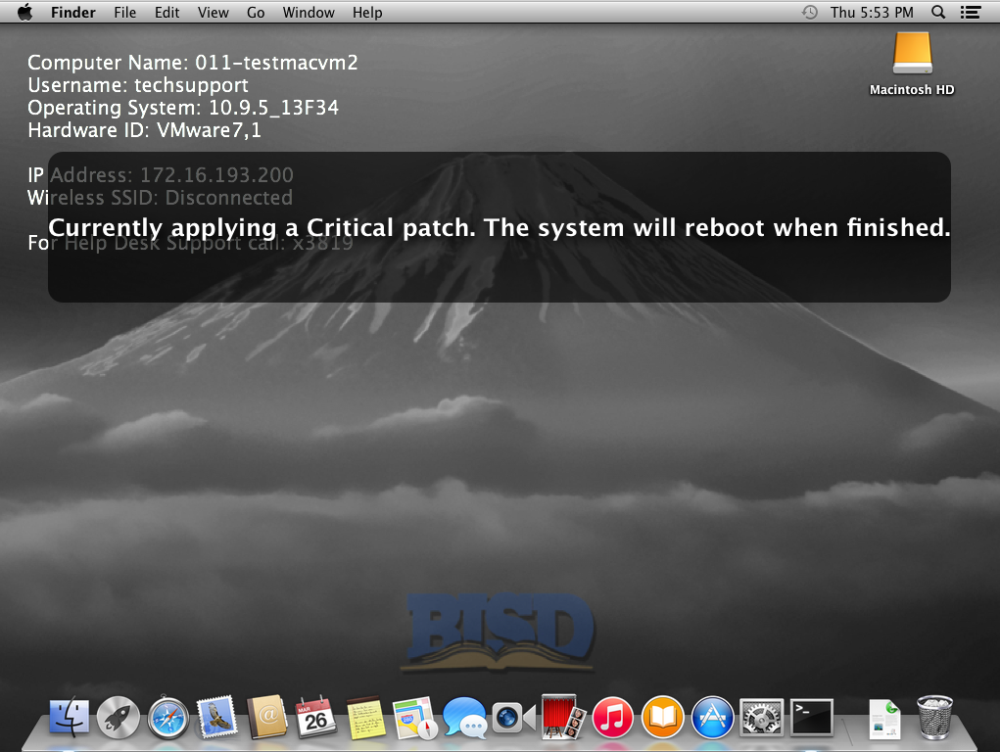

ADacctChange
===

So you have decided to change the account name of your users in Active Directory (AD). This project helps with the account migration from old account name to the new account name on Mac clients. This script also takes care of moving the home directory to the new shortname.

Blog post with greater details: [https://clburlison.com/ADacctChange](https://clburlison.com/ADacctChange) (_coming soon_)

#Table of Contents
1. [Overview](#overview)
2. [Interchangeable](#interchangeable)
3. [Variables](#variables)
    * [$DOMAIN](#domain)
4. [Supported Operating Systems](#supported-operating-systems)
5. [Sample output](#sample-output)
6. [Requires](#requires)
7. [Run manually](#run-manually)
8. [Random Notes](#random-notes)

#Overview
When running this script you will see an error message from the output of [L170](./ADacctChange.sh#L170). This is an intentional code design error. The script decides what accounts to modify based off of the ``$uniqueIDAD`` variable so if it errors on run I want to see the output. If it does not error then that user account will be skipped.

Hopefully all the check steps will verify data integrity before doing something harmful...but as always test in your environment.
I hold no responsibility for broken systems.

As it stands this LaunchDaemon will run at System Load and then again at minute 15, 30, 45, & 60. The goal is to make this change as quickly as possible and hopefully with minimal user down time. One big issue is if this script runs while a user is logged in...in my case I'm forcing a reboot. This might not be acceptable in other environments.

##Interchangeable
Windows and OS X have different names for the account records. In all examples below and in the code the:
 
	Mac shortname == Windows User logon name.
 
 From here on out if you see username, shortname, or login you should think of them as the same even though the values can be made different. 

##Variables
The variables for this script are listed below along with a brief description. 

	DCSERVER="bisd.k12"		# A domain server to check for connectivity
	DOMAIN="BISD			# Your domain (see below)
	keep1="/Users/techsupport"	# User to keep without modification
	keep2="/Users/Shared"		# User to keep without modification
	keep3="/Users/teacher"		# User to keep without modification
	setTime=1504060600		# Time in the future to run this script. Format = YearMonthDayHourMinute
	msg="Some display message"		# Display a message via BigHonkingText to end user

_Note:_ If you do not need three (3) keep users you can pass the script an empty string without issue.

###$DOMAIN
The following is an interactive prompt to find the current domain name for the ``$DOMAIN`` variable.

To find your Domain:

	$ dscl
	> ls
	> cd /Active\ Directory/
	/Active Directory > ls
	domain_name_output_here

##Supported Operating Systems
This has only been tested on the following operating systems. Though 10.8 should work I have not tested. I no longer support those machines in my environment.

* 10.7
* 10.9
* 10.10 

##Sample output

If you run the code while the ``$setTime`` variable points to a future time/date, you will see the following:

	./ADacctChange.sh 
	*** This application must be run as root. Please authenticate below. ***
	Password:
	It is not time to run this script. Now exiting.

If you run the code while the ``$setTime`` variable points to a past time/date, you will see the following:

	./ADacctChange.sh 
	*** This application must be run as root. Please authenticate below. ***
	Password:
	It is time to change the Active Directory Cached User Accounts on this system.
	Computer is on the network: YES
	<dscl_cmd> DS Error: -14136 (eDSRecordNotFound)
	Old username is:  cburlison
	Cached UID is:  123456789
	New username is:  clb
	Home for cburlison now located at /Users/clb

_Note:_ Data has been modified in the above example to generalize the output.

If a user is logged in or if the launchDaemon launches the ``ADacctChange.sh`` script while at the loginwindow, the following text will be displayed via BigHonkingText:

##Requires

* The [luggage](https://github.com/unixorn/luggage) to build the package
* A system restart to load the LaunchDaemon
* A mac that is bound to an Active Directory domain
* An AD account that has had the User logon name changed
* The current system time/date to be past April 6th, 2015 6:00am. (default value)

##Run manually
For one off cases (aka didn't get the package script installed before D-Day) use the following one-liner:

	curl -fsSL https://raw.githubusercontent.com/clburlison/scripts/master/clburlison_scripts/ADacctChange/ADacctChange.sh | sh

#Random Notes
* On 10.7 and 10.9, users are still able to log in via their Cached AD account even when the computer is able to talk with the AD server(s).
* On 10.10, users are unable to login on the computer via their Cached AD account or new login once the computer has made contact with the AD server. The computer thinks the newuseraccount is already present on the system due to it having the same UniqueID from AD. However the Cached account will not authenticate with AD since the login username has changed.
* The below commands could be useful in the future and troubleshooting.	
	
		uniqueIDLocal=`/usr/bin/dscl /Local/Default -read $a UniqueID | awk '{ print $2 }'`
		/usr/bin/id -u clburlison
		/usr/bin/dscl -plist . readall /users 
		/usr/bin/dscl /Active\ Directory/BISD/All\ Domains -read $a dsAttrTypeNative:employeeID | awk '{ print $2 }'
		/usr/bin/dscl /Active\ Directory/BISD/All\ Domains -read $a RecordName | awk '{ print $2 }'
		/usr/bin/dscl /Search -search /Users uid 1774687581
		/usr/bin/dscl -plist . readall /users
		/usr/bin/dscl . -append /Users/$ShortName RecordName $newShortName
		/usr/bin/dscl . -change /Users/$ShortName RealName $ShortName $newShortName
		/usr/bin/dscl . -list /Users
		last |grep "logged in"
